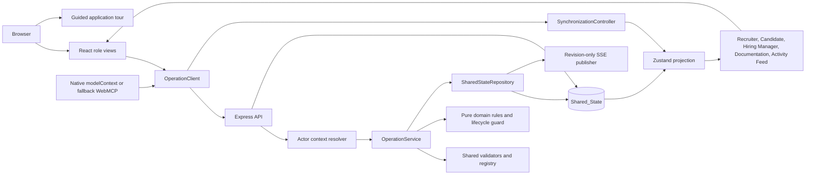
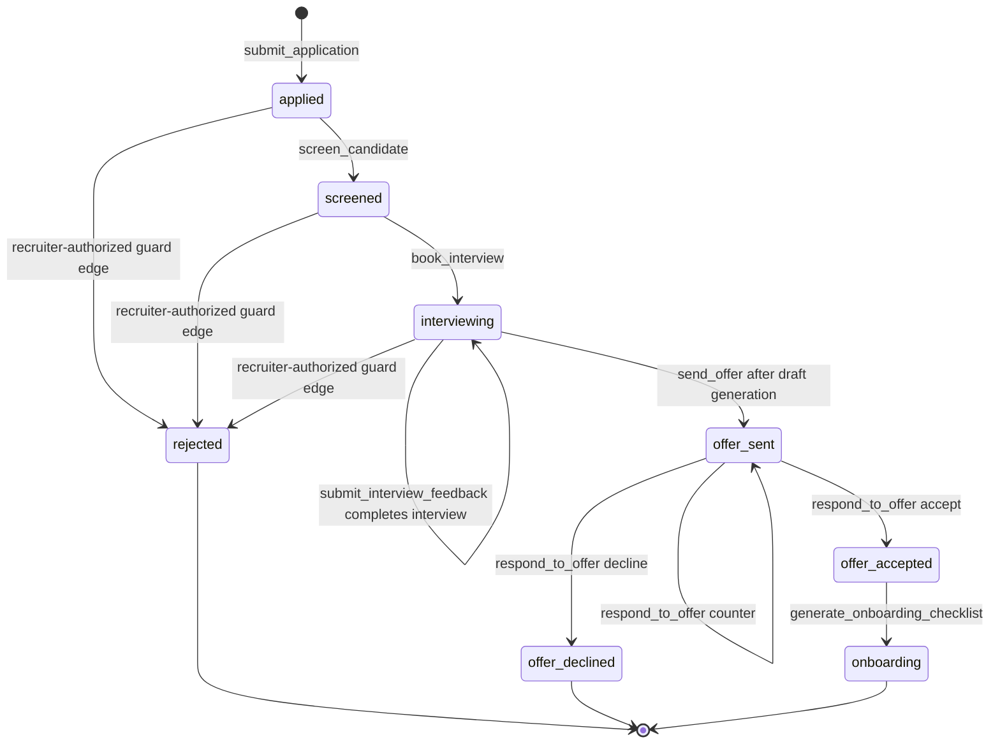

# PipelineOS

PipelineOS is a WebMCP-native recruiting platform that models the complete hiring workflow from requisition creation through onboarding. A recruiter, candidate, hiring manager, or external agent can use the same named operations against the same live state. The demo is intentionally deterministic: the repository, catalogs, availability calendars, role templates, and seed IDs are stable, while operation IDs and timestamps are supplied by injectable repository dependencies.

## Product at a glance

PipelineOS demonstrates a shared human-and-agent recruiting system rather than a collection of disconnected forms:

- **One workflow:** requisition, sourcing, application, screening, scheduling, interviewing, offer, background check, benefits, and onboarding are represented as related records.
- **One operation path:** role-view actions and WebMCP `execute` callbacks both use the browser `OperationClient`, which calls the canonical Express operation endpoint.
- **One source of truth:** the Express server owns the map-backed `SharedStateRepository`; Zustand holds an isolated client projection.
- **Auditable actions:** every invocation creates exactly one persisted activity entry containing the operation, actor, original input, exact output or structured error, and timestamp.
- **Deterministic behavior:** FAQ composition, candidate scoring, availability intersection, interview templates, onboarding dates, catalogs, reset data, and demo identifiers do not require an LLM, external API, or database.
- **Observable synchronization:** successful and failed calls refresh state locally, while revision-only SSE events tell every open view to rehydrate from `/api/state`.

The application is a demo/reference implementation, not an authentication system or a durable production database. Authentication and authorization are outside the current scope; actor headers are validated and recorded so that a real session resolver can replace the demo resolver later.

## Product architecture



### Runtime boundaries

| Boundary | Responsibility | Important implementation points |
| --- | --- | --- |
| `src/shared/` | Isomorphic contracts and pure rules | Domain models, the exact operation registry, JSON schemas, structured errors, validators, scoring, FAQ, scheduling, feedback, onboarding, and lifecycle transitions. |
| `src/server/repository.ts` | Authoritative mutable state | Map-backed records, deep-cloned snapshots, atomic sync/async transactions, injected clock and ID generator, reset, subscriptions, and monotonically increasing revisions. |
| `src/server/operationService.ts` | Shared business-operation boundary | Validates name, actor, and input; invokes an isolated handler context; validates/serializes output; commits mutations and activity atomically; audits failures without committing failed domain drafts. |
| `src/server/api.ts` | HTTP transport | Canonical operation route, state/reset endpoints, SSE stream, actor resolution, and thin compatibility aliases that still dispatch through `OperationService`. |
| `src/server/events.ts` | Change notification | Publishes `{ type: "state_changed", revision }`; records never travel in SSE, so clients always fetch an authoritative snapshot. |
| `src/client/operationClient.ts` | Browser invocation boundary | Sends `{ input }`, attaches `x-actor-type`/`x-actor-id`, parses typed output or the same `PipelineError`, and refreshes `/api/state` after success or failure. |
| `src/client/synchronization.ts` | Initial hydration and cross-tab/view sync | Hydrates once, subscribes to `/api/events`, coalesces revisions, prevents stale SSE responses from regressing the store, and stops cleanly on unmount. |
| `src/lib/store.ts` | Client projection | Stores typed arrays for all domain collections, catalogs, activity, revision, current role, and reset/hydration actions. Components never mutate domain arrays optimistically. |
| `src/lib/webmcp.ts` | WebMCP adapter | Registers exactly the shared 19 descriptors and routes every execution through `OperationClient`; it supports native, polyfill, and development registry targets. |
| `src/App.tsx` | Shell and role projections | Keeps navigation, role views, persisted activity feed, documentation, and thin event handlers together without owning server state. |
| `src/components/AppTour.tsx` | Reusable guided tour | Controlled React Joyride wrapper with stable shell targets, progress, keyboard/focus support, and an optional Documentation registry step. |

## The 19 canonical operations

The operation registry in `src/shared/operations.ts` is the single source for names, descriptions, input schemas, output schemas, implementation keys, and read-only annotations. The same descriptors are used by server validation, the Documentation view, and WebMCP registration. There is no separate `schedule_interview` operation: scheduling is represented by the availability, proposal, and booking operations below.

### Requisition and sourcing

| Operation | Kind | Behavior and output |
| --- | --- | --- |
| `create_job_requisition` | Mutation | Validates title, department, requirements, and `compBand.min <= compBand.max`; creates an open requisition with generated ID, actor ID, and timestamp; returns `{ jobId }`. |
| `search_candidates` | Read-only | Scores candidates with normalized skill/query tokens, Jaccard overlap, and an optional experience-level bonus; returns at most ten descending results with `candidateId`, `name`, `matchScore`, and rationale. |
| `get_candidate_profile` | Read-only | Returns the complete candidate record plus every matching application in `applicationHistory`. |
| `submit_application` | Mutation | Requires an existing candidate, an open job, and non-empty resume text; rejects a duplicate candidate/job pair; creates an `applied` application and retains distinct tailored resume history values; returns `{ applicationId, status: "applied" }`. |
| `answer_candidate_faq` | Read-only | Answers only from requisition title, department, requirements, and compensation band; unsupported questions return an explicit `answeredFromData: false` response. No Gemini or network call is made. |

### Screening

| Operation | Kind | Behavior and output |
| --- | --- | --- |
| `screen_candidate` | Mutation | Joins application, candidate, and requisition data; calculates a bounded, explainable score; persists score/rationale; transitions `applied` to `screened`; returns `{ applicationId, screeningScore, screeningRationale, status: "screened" }`. |

### Scheduling and interviewing

| Operation | Kind | Behavior and output |
| --- | --- | --- |
| `check_interviewer_availability` | Read-only | Intersects every panel member's deterministic free calendar inside a strict `start < end` range; returns chronological `commonFreeSlots`. |
| `propose_interview_slots` | Mutation | Resolves application → job → panel, selects the first three common slots (or fewer), creates proposed interview records, and returns `{ proposedSlots: [{ interviewId, slot }] }`. |
| `book_interview` | Mutation | Matches one proposed slot, marks it `booked`, cancels sibling proposals, and transitions the application to `interviewing`; returns `{ interviewId, status: "booked" }`. A non-matching slot is a 409 conflict with no domain mutation. |
| `get_interview_kit` | Read-only | Selects a seeded role template with three or four competency groups and questions; falls back to the generic template; returns `{ competencies }`. |
| `submit_interview_feedback` | Mutation | Validates the interview and interviewer fields, 1–5 competency scores, recommendation (`strong_yes`, `yes`, `no`, or `strong_no`), and comments; creates a scorecard and marks the interview `completed`; returns `{ scorecardId }`. |
| `get_panel_feedback_summary` | Read-only | Joins scorecards across the application's interviews and returns competency averages, recommendation tallies, and scorecard records. |

### Offer

| Operation | Kind | Behavior and output |
| --- | --- | --- |
| `generate_offer` | Mutation | Creates a draft offer for an application with the job currency, amount, nullable response fields, and a non-blocking compensation-band warning when needed; returns `{ offerId, status: "draft" }`. |
| `send_offer` | Mutation | Requires a draft offer whose application is `interviewing`; sets `sentAt`, changes the offer to `sent`, and transitions the application to `offer_sent`; returns `{ offerId, status: "sent" }`. |
| `respond_to_offer` | Mutation | Requires a sent offer. `accept` produces `accepted` and `offer_accepted`; `decline` produces `declined` and `offer_declined`; `counter` produces `countered` with a validated counter amount while leaving the application in `offer_sent`; returns `{ offerId, status }`. |

### Post-offer and onboarding

| Operation | Kind | Behavior and output |
| --- | --- | --- |
| `initiate_background_check` | Mutation | Requires an accepted offer, creates a pending background-check record, and deterministically resolves the demo check to `clear` before returning `{ backgroundCheckId, status: "clear" }`. |
| `enroll_benefits` | Mutation | Validates medical, dental, and vision selections against the seeded `Plan_Catalog`, rejects invalid selections before mutation, and creates one enrollment record; returns `{ enrollmentId }`. |
| `generate_onboarding_checklist` | Mutation | Requires an accepted offer, selects a role template, creates pending tasks from `Start_Date` offsets, rejects duplicate checklist generation, and transitions the application to `onboarding`; returns every task ID, name, and due date. |
| `get_onboarding_status` | Read-only | Joins background check, benefits, and task state; returns background status, benefits enrollment, `{ done, total }`, and a zero-safe completion percentage. |

**Read-only operations:** `search_candidates`, `get_candidate_profile`, `answer_candidate_faq`, `check_interviewer_availability`, `get_interview_kit`, `get_panel_feedback_summary`, and `get_onboarding_status`. They preserve all domain collections, but their invocation is still audited and advances the repository revision. The other twelve operations are mutations.

## Role views and end-to-end flows

### Recruiter view

The Recruiter Dashboard is the operational control surface. It can:

1. Create requisitions with requirements and a structured compensation band.
2. Search/rank candidates and open a complete profile/application history.
3. Screen an application and inspect its persisted score and rationale.
4. Check common interviewer availability, propose slots, and book from the Kanban card.
5. Load panel feedback summaries after scorecards are submitted.
6. Generate/send an offer, including any compensation warning.
7. Start a deterministic background check, generate an onboarding checklist, and refresh onboarding status.
8. See every application in a Kanban column based on its persisted lifecycle status.

### Candidate view

The Candidate Portal uses the deterministic `cand-1` / Alice Chen demo identity. It can:

1. View open jobs and submit one application per candidate/job pair.
2. Ask a requisition-only FAQ question and see whether the answer came from data.
3. View proposed interview slots and book one; sibling proposals disappear after booking.
4. Review sent offers and accept, decline, or counter with a validated amount.
5. Select catalog-backed medical, dental, and vision plans.
6. View background-check status, benefits state, onboarding tasks, due dates, and completion percentage.

### Hiring Manager view

The Hiring Manager Portal can load the role-specific interview kit, inspect candidate profiles, submit validated scorecards for booked interviews, and see completed interview/scorecard state. The demo hiring-manager actor is `morgan-hiring-manager`.

### Documentation view

Documentation renders the same 19 `OPERATION_REGISTRY` descriptors used at runtime. Each entry shows its mutation/read-only classification, description, input JSON Schema, output JSON Schema, and WebMCP annotations. This view is also the optional final spotlight in the guided tour when the Documentation role is active.

### Canonical demo flow

The seeded path is ready to replay after **Reset DB (Demo)**:

1. Start with `job-1`, **Senior Backend Engineer**, an open Engineering requisition with a USD 160,000–190,000 band and `panel-1`.
2. In Candidate view, submit `cand-1`'s resume to `job-1` (`submit_application`).
3. In Recruiter view, screen the new application (`screen_candidate`).
4. Check availability and propose the first three common slots (`check_interviewer_availability`, then `propose_interview_slots`).
5. Book one proposal, for example `2026-09-01T10:00:00Z` (`book_interview`).
6. In Hiring Manager view, load the Engineering kit and submit a scorecard (`get_interview_kit`, `submit_interview_feedback`).
7. In Recruiter view, generate a draft around the middle of the band (for example `175000`) and send it (`generate_offer`, `send_offer`).
8. In Candidate view, accept the sent offer (`respond_to_offer` with `decision: "accept"`).
9. Initiate the background check, select valid plans, generate the checklist, and read status (`initiate_background_check`, `enroll_benefits`, `generate_onboarding_checklist`, `get_onboarding_status`).
10. Switch among all views: the Kanban, candidate portal, hiring-manager records, Documentation registry, and Live Activity Feed should all reflect the same persisted snapshot.

The lifecycle guard also supports recruiter-authorized pre-offer rejection edges from `applied`, `screened`, or `interviewing` to terminal `rejected`. There is no separate rejection operation in the exact 19-operation registry; the guard is the single authority for service handlers that need that transition. `offer_declined`, `rejected`, and `onboarding` are terminal application states.

## Canonical lifecycle, validation, rollback, and synchronization

### Application state flow



`generate_offer` creates an offer draft but does not move the application. `initiate_background_check` and `enroll_benefits` add records associated with an accepted offer; checklist generation is the operation that moves the accepted application to `onboarding`. Every status-changing handler calls the shared lifecycle guard before changing its draft.

### Atomic operation behavior

For each invocation, `OperationService.invoke` performs the following sequence:

1. Resolve and validate the operation name and `ActorContext`.
2. Validate input against the operation descriptor's shared JSON Schema-derived validator.
3. Give the handler an isolated repository snapshot for reads or a private transaction draft for mutations. Handlers cannot access React, Zustand, Express, WebMCP, or the repository mutator.
4. Validate and JSON-serialize the declared output before a mutation can commit.
5. For a successful mutation, append its activity entry to the same draft and commit the domain records plus audit entry as one revision.
6. For a read-only call, preserve all domain collections, append its activity entry in an audit-only commit, and advance one revision.
7. For validation, not-found, conflict, or unexpected errors, discard the private mutation draft and append exactly one structured failure activity entry containing the original input. The failed domain records are not committed.

Structured errors use the same `PipelineError` shape through HTTP, UI, and WebMCP. The normal codes are `VALIDATION_ERROR` (400), `NOT_FOUND_ERROR` (404), `CONFLICT_ERROR` (409), and `INTERNAL_ERROR` (500).

### State, activity, and reset semantics

The repository keeps maps internally for lookup and serializes stable arrays through `/api/state`:

| Collection/catalog | Purpose |
| --- | --- |
| Jobs | Requisitions, including `compBand`, status, creator, and timestamp. |
| Candidates | Profiles, skills, original resume, and distinct `resumeTextHistory`. |
| Applications | Candidate/job joins, lifecycle status, screening values, notes, and creation time. |
| Panels and calendars | Interviewer membership and deterministic free slots. |
| Interviews | Proposed/booked/completed/cancelled slots. |
| Scorecards | Structured interviewer feedback and recommendations. |
| Offers | Draft/sent/accepted/declined/countered compensation records and warnings. |
| Background checks | Deterministically completed post-offer check records. |
| Benefits enrollments | Catalog-validated medical/dental/vision selections. |
| Onboarding tasks | Template-derived pending/in-progress/complete tasks and due dates. |
| Activity log | One audit entry per invocation, including reads and failures. |
| Role templates and plan catalogs | Read-only deterministic support catalogs. |

`read()` and `snapshot()` return deep clones, so callers cannot mutate server state out of band. `reset()` installs a fresh clone of the seed and publishes a repository change; it restores domain collections and clears the activity log, while the revision remains monotonic so SSE consumers can converge. The reset button then fetches `/api/state` and updates the client projection.

### Operation/synchronization sequence

```mermaid
sequenceDiagram
    actor Actor
    participant UI as React UI or WebMCP
    participant Client as OperationClient
    participant API as Express API
    participant Service as OperationService
    participant Repo as SharedStateRepository
    participant SSE as Revision SSE
    participant Store as Zustand store

    Actor->>UI: Invoke named operation
    UI->>Client: invoke(name, input, actor)
    Client->>API: POST /api/operations/:name { input }
    API->>Service: resolve actor and dispatch
    Service->>Repo: validate and run isolated draft
    Repo-->>Service: commit output, activity, revision
    Service-->>API: typed output or structured error
    API-->>Client: JSON response
    Client->>API: GET /api/state after completion
    API-->>Client: latest JSON-safe projection
    Client->>Store: hydrate authoritative snapshot
    Repo->>SSE: state_changed with revision only
    SSE-->>UI: open clients receive revision hint
    UI->>API: GET /api/state for newer revision
    API-->>Store: hydrate coalesced latest snapshot
```

The startup lifecycle is also guarded for React StrictMode. `ApplicationBootstrap` reference-counts consumers, registers WebMCP once, starts initial synchronization once, and defers stop so StrictMode's setup/cleanup probe does not create duplicate SSE connections. A real unmount closes the event source.

## WebMCP, HTTP, actor context, and fallback behavior

### Native and fallback registration

`registerAllTools()` iterates the exact operation registry and registers 19 descriptors once per application bootstrap:

1. If `document.modelContext.registerTool` exists, PipelineOS passes `{ name, description, inputSchema, execute, annotations }` to the native model-context runtime.
2. If only the repository's development `navigator.modelContext.registerTool` shape exists, the adapter translates `inputSchema` to `schema` and `execute` to `handler`.
3. If neither runtime exists, the descriptor is retained in `window.__webmcp_tools` for local demos, documentation, and automated adapter tests.

Every `execute` callback invokes the shared `OperationClient` with the default agent context `{ actorType: "agent", actorId: "agent-demo" }` unless a caller supplies another agent ID. Read-only descriptors expose `annotations.readOnlyHint: true`. The adapter does not maintain a second activity log, optimistic domain update, or WebMCP-only result.

### Canonical HTTP invocation

```http
POST /api/operations/search_candidates
Content-Type: application/json
Accept: application/json
x-actor-type: agent
x-actor-id: agent-demo

{"input":{"query":"backend","skills":["AWS"]}}
```

A successful response is the operation's declared output, for example:

```json
{
  "results": [
    {
      "candidateId": "cand-1",
      "name": "Alice Chen",
      "matchScore": 75,
      "rationale": "Matched skills: AWS; matched query terms: backend."
    }
  ]
}
```

An error response uses the shared serialized envelope:

```json
{
  "error": {
    "code": "CONFLICT_ERROR",
    "status": 409,
    "message": "Application cannot transition from \"applied\" to \"interviewing\"",
    "details": {
      "recordType": "ApplicationRecord",
      "field": "status"
    }
  }
}
```

The canonical server routes are:

| Method and path | Behavior |
| --- | --- |
| `POST /api/operations/:operationName` | Dispatches `{ input }` through `OperationService` with actor headers. |
| `GET /api/state` | Returns the complete JSON-safe state projection, catalogs, activity log, and revision. |
| `POST /api/reset` | Restores a fresh deterministic seed and returns `{ success, revision }`. |
| `GET /api/events` | Opens an SSE stream whose `state_changed` frames contain only the latest revision. |

Legacy routes such as `/api/jobs`, `/api/candidates/search`, `/api/applications/:id/screen`, `/api/interviews/*`, `/api/offers/*`, and their read aliases remain compatibility adapters. They translate path/body shapes and, for offer responses, legacy decision spellings; they do not contain separate business logic or mutate state directly.

### Actor context

| Source | Actor metadata |
| --- | --- |
| Recruiter UI | `human_ui` / `sarah-recruiter` |
| Candidate UI | `human_ui` / `alice-candidate` |
| Hiring Manager UI | `human_ui` / `morgan-hiring-manager` |
| WebMCP agent default | `agent` / `agent-demo` |

Actor metadata is transport context, not operation input. The API resolves `x-actor-type` and `x-actor-id`, applies deterministic demo defaults when headers are absent, validates the result, and writes the actor into the activity entry.

## Guided application tour

The navigation's **Start Tour** control opens a controlled React Joyride tour implemented in `src/components/AppTour.tsx`. It includes:

- stable targets for the PipelineOS brand, role switcher, active role view, main workflow, Start Tour control, reset/demo control, Documentation navigation, and Live Activity Feed;
- an optional Documentation registry step when the Documentation view is mounted, avoiding a broken target on other views;
- visible **Back**, **Next/Finish**, **Skip**, and **Close** controls with `Step N of M` progress;
- Joyride's focus trap, keyboard handling, and Escape-to-close behavior, with overlay clicks disabled so accidental clicks do not end the tour;
- a reusable `getAppTourSteps()` configuration that can be tested without a browser and a navigation entry that reopens the tour after it is closed or skipped.

The tour is presentation-only. It does not mutate the store, alter role selection, reset state, or participate in WebMCP/bootstrap registration.

## Public job catalog and importer boundary

The server-side importer in `src/server/imports/` remains a source-agnostic boundary for **approved, compliant public job listings**. The live catalog connects only to these public JSON feeds, sequentially, through injected adapters:

- [Jobicy public remote jobs API documentation](https://github.com/jobicy/remote-jobs-api) and [Jobicy feed guidance](https://jobicy.com/jobs-rss-feed), fetched from `https://jobicy.com/api/v2/remote-jobs?count=50&industry=engineering`.
- [Arbeitnow Job Board API documentation](https://www.arbeitnow.com/blog/job-board-api), fetched from `https://www.arbeitnow.com/api/job-board-api`.

Each adapter validates its expected JSON shape, strips source HTML into plain text, derives deterministic non-empty requirements from published tags/industry/description, and normalizes title, company, location, description, source attribution, external ID, fetch time, and available employment metadata into `PublicJobListingRecord`. The original listing URL supplied by a feed is retained as `canonicalSourceUrl` using the importer’s documented URL canonicalization (HTTP(S), normalized host, query/path retained, fragment removed), and the UI provides a direct **View original listing** link. Source feed URLs and per-listing attribution remain visible in the API response.

`GET /api/public-jobs` is a read-only API/UI catalog endpoint, not a WebMCP operation. The recruiter dashboard loads it only when the Recruiter view is used and provides an explicit `GET /api/public-jobs?refresh=true` refresh path. Results are cached independently per source for 15 minutes by default; a cache hit makes no network request, while an explicit refresh bypasses the cache. Requests are on-demand polling only: the selected feeds do not provide webhooks, so PipelineOS does not claim real-time push. Feed failures are isolated and returned as structured per-source errors; stale cached listings from a failed source can remain visible alongside successful results, and server startup does not depend on feed availability. Freshness depends on the upstream feeds and their publication timing.

These listings are external public catalog data and are **not yet internal requisitions**. They are not written to `SharedStateRepository`, do not create applications, and do not add or remove any of the exact 19 canonical WebMCP operations. Candidate records and the candidate workflow remain synthetic/demo records until an authorized candidate source is provided. No candidate profiles, resumes, contact data, or applications are collected or sent through this catalog, and PipelineOS does not scrape arbitrary HTML pages or bypass source restrictions.

Before using or extending an adapter, verify the source terms, licensing, rate limits, attribution rules, retention policy, and applicable privacy obligations. The implementation uses only the two approved public JSON feeds, a descriptive `Accept`/`User-Agent`, sequential requests, and a conservative cache. Content was rephrased for compliance with licensing restrictions.

The existing importer boundary can still persist normalized listings to an explicitly supplied `PublicJobListingStore` for an authorized import workflow. Malformed records are rejected with field paths and actionable errors; the live coordinator instead keeps its external-feed cache separate from the recruiting repository. `createSyntheticCandidates()` in `src/server/imports/syntheticCandidates.ts` returns a fresh deterministic fixture set marked `synthetic: true` and `dataOrigin: "synthetic"`, using reserved `.example.test` email addresses.

## Local setup

### Prerequisites

Use a current Node.js/npm installation that supports the repository's ESM TypeScript toolchain. Node.js 20 or newer is recommended. No external database, WebMCP npm package, Gemini key, or network service is required for the deterministic demo and test suite.

### Install and run the demo

```bash
npm install
npm run dev
```

Open <http://localhost:3000>. The development server is `tsx server.ts`; Vite supplies the SPA middleware and Express supplies `/api/*`.

The provided `.env.example` documents `GEMINI_API_KEY` and `APP_URL` values used by the surrounding AI Studio/hosting environment. The current canonical FAQ and recruiting operations are deterministic and do not call Gemini, so those values are not required for local PipelineOS behavior. The server's process-level environment switch is `NODE_ENV`: production serves the built `dist` directory, while non-production runs Vite middleware.

### Configuration and programmatic composition

`server.ts` exports `createServerApp(options)` and `startServer(options)`. The default port is `3000` and the default host is `0.0.0.0`; callers embedding the composition root can provide `port`, `host`, repository, operation service, handlers, or event publisher. The demo does not read a `PORT` environment variable automatically.

### Non-watch validation

These are the repository's single-run validation commands:

```bash
npm run lint   # tsc --noEmit
npm test       # vitest run
npm run build  # vite build plus bundled dist/server.cjs
```

For a focused test file, use Vitest's single-run filter, for example:

```bash
npx vitest run test/app-tour.test.ts
```

Do not use `vitest watch` or start `npm run dev` as a validation substitute. `npm run build` creates the browser bundle and `dist/server.cjs`; it does not start a server.

### Production build and start

```bash
npm run build
NODE_ENV=production npm start
```

`npm start` runs `node dist/server.cjs`. Setting `NODE_ENV=production` makes the composition root serve the static `dist` SPA from Express instead of attempting Vite middleware. On PowerShell, use `$env:NODE_ENV = "production"; npm start`.

## Testing and property-test conventions

- Tests live in `test/` and run with Vitest's non-watch `vitest run` script.
- Pure domain rules have focused unit coverage for lifecycle edges, scoring bounds, FAQ provenance, date ranges, availability, feedback aggregation, role templates, and zero-task onboarding status.
- Repository/service behavior has contract, HTTP, reset, rollback, activity, and transport tests.
- `fast-check` properties use deterministic factories and at least 100 runs. Property tests are named and annotated with their requirement/property links, for example `**Validates: Requirements 1.4, 5.4**`.
- Cross-interface tests invoke the real `OperationClient` and WebMCP adapter against an in-memory service, hydrate the real Zustand store, render the actual role shell to static markup, and check shared projections. They do not mock the operation implementation or use an external API.
- The tour's browser-independent configuration is covered by `test/app-tour.test.ts`; the existing SSR shell tests cover role/documentation rendering and the shared activity feed.
- Keep test inputs JSON-safe and use seeded repositories, fixed clocks, and deterministic ID generators when a test needs stable output.

## Troubleshooting and demo guidance

### The page is blank or shows a boot error

Check the terminal running `npm run dev`, then request `http://localhost:3000/api/state` directly. The initial `ApplicationBootstrap` waits for `/api/state` before considering the app ready. Confirm that port 3000 is free and that the server is running from the repository root.

### A UI action appears to do nothing

The UI waits for the operation response and the follow-up state refresh; inspect the Live Activity Feed for a structured validation/not-found/conflict error. The feed is authoritative, so an error entry should appear even when the action did not change domain collections. For conflicts, reset the demo and follow the lifecycle order rather than trying to skip a state.

### Views are stale after an agent call

Inspect `/api/events` in the browser Network panel. The SSE payload intentionally contains only a revision; the synchronization controller then fetches `/api/state`. The `OperationClient` also refreshes after its own success or failure, so an agent call made outside the browser should be followed by an event or a manual state refresh in a running UI.

### WebMCP tools are not visible

In a development browser, inspect `window.__webmcp_tools` and confirm it contains the 19 canonical names. A host that supplies native `document.modelContext` or the repository's `navigator.modelContext` polyfill takes precedence over that development registry. The application does not install a runtime WebMCP package itself.

### The tour does not show a Documentation registry step

That step is intentionally conditional. Switch to Documentation and click Start Tour again; the registry target is mounted only in that role view. The shared shell steps remain available from every view. Use keyboard Tab/Escape or the visible Close/Skip controls to leave the tour.

### The demo contains old records

Click **Reset DB (Demo)**. Reset restores `job-1`, the three seeded candidates, `panel-1`, deterministic availability/catalogs/templates, empty workflow collections, and an empty activity log. The revision number may be higher after reset by design; clients use it to converge rather than infer that records are stale.

### A production start serves the wrong mode

Run `npm run build` first and set `NODE_ENV=production` before `npm start`. Without that environment setting, `server.ts` selects its non-production Vite middleware branch.

## Repository map

```text
pipelineos/
├── src/
│   ├── App.tsx                         # shell, role views, feed, Documentation view
│   ├── components/AppTour.tsx          # controlled accessible guided tour
│   ├── client/
│   │   ├── actorContext.ts              # role-to-actor and agent context
│   │   ├── bootstrap.ts                 # StrictMode-safe startup lifecycle
│   │   ├── operationClient.ts           # canonical browser invocation boundary
│   │   └── synchronization.ts            # /api/state hydration and SSE revisions
│   ├── lib/
│   │   ├── store.ts                     # typed Zustand projection
│   │   ├── viewModels.ts                # Kanban/activity projections
│   │   └── webmcp.ts                    # native/polyfill/development adapter
│   ├── server/
│   │   ├── api.ts                       # Express routes and serialization
│   │   ├── events.ts                    # revision-only SSE publisher
│   │   ├── imports/                     # compliant public-listing importer and synthetic fixtures
│   │   ├── operationService.ts           # validation, dispatch, audit, transaction
│   │   ├── operations/                  # one handler per canonical operation
│   │   ├── repository.ts                # atomic map-backed repository
│   │   └── seed.ts                      # deterministic records/catalogs/templates
│   └── shared/
│       ├── domain/                      # lifecycle, scoring, FAQ, scheduling, etc.
│       ├── errors.ts                    # structured PipelineError contract
│       ├── models.ts                    # domain/state types
│       ├── operations.ts                # exact 19-operation registry and schemas
│       └── validators.ts                # shared field/input/output validation
├── test/                                # unit, property, HTTP, and integration tests
├── server.ts                            # Express/Vite composition root
├── package.json                          # dev, validation, build, and start scripts
└── .env.example                         # hosting/AI Studio sample variables
```

## License and scope

This repository is a deterministic demonstration of a shared human-and-agent recruiting workflow. It intentionally uses an in-memory repository and demo actor identities. Replace the repository, actor resolver, and hosting configuration before treating it as a production recruiting system.
