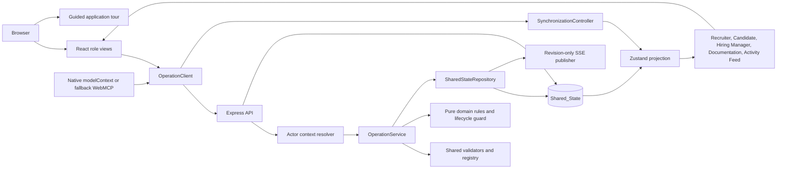
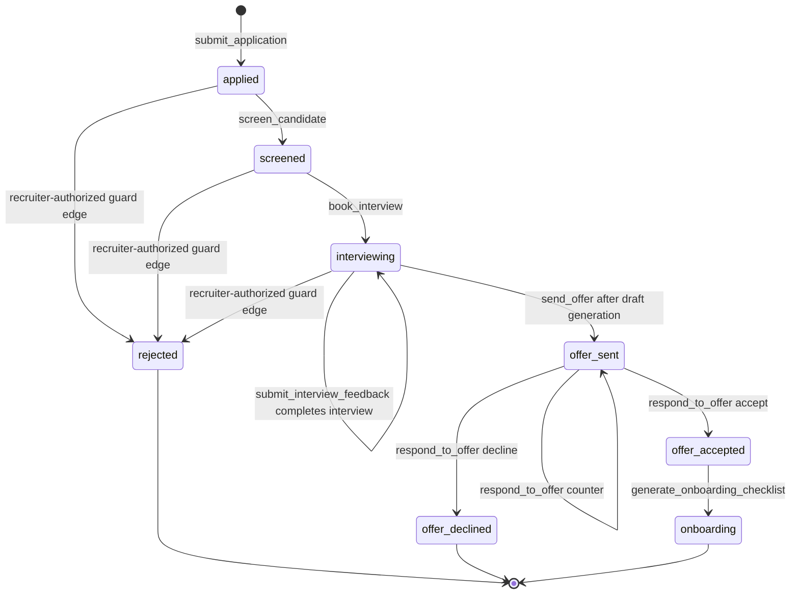

# PipelineOS

PipelineOS is a WebMCP-native recruiting platform that models the complete hiring workflow from requisition creation through onboarding. A recruiter, candidate, hiring manager, or external agent can use the same named operations against the same live state. The demo is intentionally deterministic: the repository, catalogs, availability calendars, role templates, and seed IDs are stable, while operation IDs and timestamps are supplied by injectable repository dependencies.

## Product at a glance

PipelineOS demonstrates a shared human-and-agent recruiting system rather than a collection of disconnected forms:

- **One workflow:** requisition, sourcing, application, screening, scheduling, interviewing, offer, background check, benefits, and onboarding are represented as related records.
- **One operation path:** role-view actions and WebMCP `execute` callbacks both use the browser `OperationClient`, which calls the canonical Express operation endpoint.
- **One source of truth:** the Express server owns the map-backed `SharedStateRepository`; Zustand holds an isolated client projection.
- **Auditable actions:** every invocation creates exactly one persisted activity entry containing the operation, actor, original input, exact output or structured error, and timestamp.
- **Deterministic behavior:** FAQ composition, candidate scoring, availability intersection, interview templates, onboarding dates, catalogs, reset data, and demo identifiers do not require an LLM, external API, or database.
- **Observable synchronization:** successful and failed calls refresh state locally, while revision-only SSE events tell every open view to rehydrate from `/api/state`.

The application is a deterministic demo/reference implementation with an in-memory repository, not a production identity provider or durable database. Non-production demo requests accept only known seeded identities; the production composition root requires a trusted host resolver, and arbitrary actor headers are never authentication. Every authorized state projection is actor/resource scoped.

## Product architecture



### Runtime boundaries

| Boundary | Responsibility | Important implementation points |
| --- | --- | --- |
| `src/shared/` | Isomorphic contracts and pure rules | Domain models, the exact operation registry, JSON schemas, structured errors, validators, scoring, FAQ, scheduling, feedback, onboarding, and lifecycle transitions. |
| `src/server/repository.ts` | Authoritative mutable state | Map-backed records, deep-cloned snapshots, atomic sync/async transactions, injected clock and ID generator, reset, subscriptions, and monotonically increasing revisions. |
| `src/server/operationService.ts` | Shared business-operation boundary | Validates name, actor, and input; invokes an isolated handler context; validates/serializes output; commits mutations and activity atomically; audits failures without committing failed domain drafts. |
| `src/server/api.ts` | HTTP transport | Canonical operation route, state/reset endpoints, SSE stream, actor resolution, and thin compatibility aliases that still dispatch through `OperationService`. |
| `src/server/events.ts` | Change notification | Publishes `{ type: "state_changed", revision }`; records never travel in SSE, so clients always fetch an authoritative snapshot. |
| `src/client/operationClient.ts` | Browser invocation boundary | Sends `{ input }`, attaches `x-actor-type`/`x-actor-id`, parses typed output or the same `PipelineError`, and refreshes `/api/state` after success or failure. |
| `src/client/synchronization.ts` | Initial hydration and cross-tab/view sync | Hydrates once, subscribes to `/api/events`, coalesces revisions, prevents stale SSE responses from regressing the store, and stops cleanly on unmount. |
| `src/lib/store.ts` | Client projection | Stores typed arrays for all domain collections, catalogs, activity, revision, current role, and reset/hydration actions. Components never mutate domain arrays optimistically. |
| `src/lib/webmcp.ts` | WebMCP adapter | Registers exactly the shared 32 descriptors and routes every execution through `OperationClient`; it supports native, polyfill, and development registry targets. Capability and approval metadata come from the same registry. |
| `src/App.tsx` | Shell and role projections | Keeps navigation, role views, actor-aware documentation, persisted activity feed, and thin event handlers together without owning server state. |
| `src/components/AppTour.tsx` | Reusable guided tour | Controlled React Joyride wrapper with stable shell targets, progress, keyboard/focus support, and an optional Documentation registry step. |

## The 32 canonical operations

The operation registry in `src/shared/operations.ts` is the single source for names, descriptions, input schemas, output schemas, implementation keys, and read-only annotations. The same descriptors are used by server validation, the Documentation view, and WebMCP registration. There is no separate `schedule_interview` operation: scheduling is represented by the availability, proposal, and booking operations below.

### Requisition and sourcing

| Operation | Kind | Behavior and output |
| --- | --- | --- |
| `create_job_requisition` | Mutation | Validates title, department, requirements, and `compBand.min <= compBand.max`; creates an open requisition with generated ID, actor ID, and timestamp; returns `{ jobId }`. |
| `search_candidates` | Read-only | Scores candidates with normalized skill/query tokens, Jaccard overlap, and an optional experience-level bonus; returns at most ten descending results with `candidateId`, `name`, `matchScore`, and rationale. |
| `get_candidate_profile` | Read-only | Returns the complete candidate record plus every matching application in `applicationHistory`. |
| `submit_application` | Mutation | Requires an existing candidate, an open job, and non-empty resume text; rejects a duplicate candidate/job pair; creates an `applied` application and retains distinct tailored resume history values; returns `{ applicationId, status: "applied" }`. |
| `answer_candidate_faq` | Read-only | Answers only from requisition title, department, requirements, and compensation band; unsupported questions return an explicit `answeredFromData: false` response. No Gemini or network call is made. |

### Screening

| Operation | Kind | Behavior and output |
| --- | --- | --- |
| `screen_candidate` | Mutation | Joins application, candidate, and requisition data; calculates a bounded, explainable score; persists score/rationale; transitions `applied` to `screened`; returns `{ applicationId, screeningScore, screeningRationale, status: "screened" }`. |

### Scheduling and interviewing

| Operation | Kind | Behavior and output |
| --- | --- | --- |
| `check_interviewer_availability` | Read-only | Intersects every panel member's deterministic free calendar inside a strict `start < end` range; returns chronological `commonFreeSlots`. |
| `propose_interview_slots` | Mutation | Resolves application → job → panel, selects the first three common slots (or fewer), creates proposed interview records, and returns `{ proposedSlots: [{ interviewId, slot }] }`. |
| `book_interview` | Mutation | Matches one proposed slot, marks it `booked`, cancels sibling proposals, and transitions the application to `interviewing`; returns `{ interviewId, status: "booked" }`. A non-matching slot is a 409 conflict with no domain mutation. |
| `get_interview_kit` | Read-only | Selects a seeded role template with three or four competency groups and questions; falls back to the generic template; returns `{ competencies }`. |
| `submit_interview_feedback` | Mutation | Validates the interview and interviewer fields, 1–5 competency scores, recommendation (`strong_yes`, `yes`, `no`, or `strong_no`), and comments; creates a scorecard and marks the interview `completed`; returns `{ scorecardId }`. |
| `get_panel_feedback_summary` | Read-only | Joins scorecards across the application's interviews and returns competency averages, recommendation tallies, and scorecard records. |

### Offer

| Operation | Kind | Behavior and output |
| --- | --- | --- |
| `generate_offer` | Mutation | Creates a draft offer for an application with the job currency, amount, nullable response fields, and a non-blocking compensation-band warning when needed; returns `{ offerId, status: "draft" }`. |
| `send_offer` | Mutation | Requires a draft offer whose application is `interviewing`; sets `sentAt`, changes the offer to `sent`, and transitions the application to `offer_sent`; returns `{ offerId, status: "sent" }`. |
| `respond_to_offer` | Mutation | Requires a sent offer. `accept` produces `accepted` and `offer_accepted`; `decline` produces `declined` and `offer_declined`; `counter` produces `countered` with a validated counter amount while leaving the application in `offer_sent`; returns `{ offerId, status }`. |

### Post-offer and onboarding

| Operation | Kind | Behavior and output |
| --- | --- | --- |
| `initiate_background_check` | Mutation | Requires an accepted offer, creates a pending background-check record, and deterministically resolves the demo check to `clear` before returning `{ backgroundCheckId, status: "clear" }`. |
| `enroll_benefits` | Mutation | Validates medical, dental, and vision selections against the seeded `Plan_Catalog`, rejects invalid selections before mutation, and creates one enrollment record; returns `{ enrollmentId }`. |
| `generate_onboarding_checklist` | Mutation | Requires an accepted offer, selects a role template, creates pending tasks from `Start_Date` offsets, rejects duplicate checklist generation, and transitions the application to `onboarding`; returns every task ID, name, and due date. |
| `get_onboarding_status` | Read-only | Joins background check, benefits, and task state; returns background status, benefits enrollment, `{ done, total }`, and a zero-safe completion percentage. |

### Plans, approvals, comparison, provenance, and coordination

| Operation | Kind | Behavior and output |
| --- | --- | --- |
| `plan_operation` | Plan mutation | Validates one of the three planable targets (`import_public_prospect`, `coordinate_interview_workflow`, or `coordinate_onboarding_workflow`), runs it against an isolated preview, and persists a redacted approval card without changing target records. |
| `get_approval_card` | Read-only | Returns the actor-scoped safe approval-card summary; normalized input, fingerprints, consent evidence, and other protected fields remain server-private. |
| `approve_operation_plan` / `reject_operation_plan` | Approval mutation | Trusted human approval principals change only the card lifecycle. Agents cannot approve or reject, and the target business mutation is not applied until commit. |
| `commit_operation_plan` | Commit mutation | Revalidates approval, policy version, consent, target fingerprint, and revision before applying the plan atomically; returns the target result wrapper. |
| `compare_candidates` | Read-only | Produces bounded, deterministic requirement/skill/experience evidence and explainable ranking for a permitted job and candidate set. |
| `get_recruiting_workflow_status` | Read-only | Returns one snapshot-consistent, actor-scoped view of application counts, blockers, next actions, and pending approvals. |
| `import_public_prospect` | Consent-and-human commit | Imports only an allowlisted public result with explicit consent and human approval; persists provenance, field origins, attribution, and retention metadata without synthesizing private contact data. |
| `revoke_public_prospect_consent` | Human-approved commit | Withdraws consent through an idempotent terminal operation and blocks future reuse of the withdrawn record. |
| `coordinate_interview_workflow` | Human-approved commit | Coordinates deterministic slot proposals or booking through shared scheduling commands, with bounded child trace spans and stale/idempotent protection. |
| `coordinate_onboarding_workflow` | Human-approved commit | Initializes an accepted-offer checklist or advances one task through `pending → in_progress → complete` using one atomic operation. |
| `discover_capabilities` | Read-only | Returns the versioned, actor/resource-scoped capability manifest used for informational Documentation and host discovery; execute-time policy remains authoritative. |

The registry currently contains 32 canonical operations: 12 read-only operations and 20 mutations/plans/approval commits. Six operations use human approval, `import_public_prospect` uses consent plus human approval, and the three coordinator/import targets are planable. All 32 descriptors are registered by WebMCP and use the same schemas, annotations, capability labels, and structured error contract.

**Read-only operations:** `search_candidates`, `search_public_candidates`, `get_candidate_profile`, `answer_candidate_faq`, `check_interviewer_availability`, `get_interview_kit`, `get_panel_feedback_summary`, `get_onboarding_status`, `get_approval_card`, `compare_candidates`, `get_recruiting_workflow_status`, and `discover_capabilities`. They preserve business collections, but their invocation is still audited and advances the repository revision. The other twenty registry entries are plan, approval, or mutation paths.

## Role views and end-to-end flows

### Recruiter view

The Recruiter Dashboard is the operational control surface. It can:

1. Create requisitions with requirements and a structured compensation band.
2. Search public GitHub prospects from the **Source candidates** form, with an external profile link and consent boundary; use the canonical `search_candidates` operation separately when searching PipelineOS Candidate_Record data.
3. Screen an application and inspect its persisted score and rationale.
4. Check common interviewer availability, propose slots, and book from the Kanban card.
5. Load panel feedback summaries after scorecards are submitted.
6. Generate/send an offer, including any compensation warning.
7. Start a deterministic background check, generate an onboarding checklist, and refresh onboarding status.
8. See every application in a Kanban column based on its persisted lifecycle status.

### Candidate view

The Candidate Portal uses the deterministic `cand-1` / Alice Chen demo identity. It can:

1. View open jobs and submit one application per candidate/job pair.
2. Ask a requisition-only FAQ question and see whether the answer came from data.
3. View proposed interview slots and book one; sibling proposals disappear after booking.
4. Review sent offers and accept, decline, or counter with a validated amount.
5. Select catalog-backed medical, dental, and vision plans.
6. View background-check status, benefits state, onboarding tasks, due dates, and completion percentage.

### Hiring Manager view

The Hiring Manager Portal can load the role-specific interview kit, inspect candidate profiles, submit validated scorecards for booked interviews, and see completed interview/scorecard state. The demo hiring-manager actor is `morgan-hiring-manager`.

### Documentation view

Documentation renders the same 32 `OPERATION_REGISTRY` descriptors used at runtime. Each entry shows its mutation/read-only/plan/approval classification, description, input/output JSON Schema, WebMCP annotations, required capability, approval policy, and the current actor-scoped manifest decision. This view is also the optional final spotlight in the guided tour when the Documentation role is active.

### Canonical demo flow

The seeded path is ready to replay after **Reset DB (Demo)**:

1. Start with `job-1`, **Senior Backend Engineer**, an open Engineering requisition with a USD 160,000–190,000 band and `panel-1`.
2. In Candidate view, submit `cand-1`'s resume to `job-1` (`submit_application`).
3. In Recruiter view, screen the new application (`screen_candidate`).
4. Check availability and propose the first three common slots (`check_interviewer_availability`, then `propose_interview_slots`).
5. Book one proposal, for example `2026-09-01T10:00:00Z` (`book_interview`).
6. In Hiring Manager view, load the Engineering kit and submit a scorecard (`get_interview_kit`, `submit_interview_feedback`).
7. In Recruiter view, generate a draft around the middle of the band (for example `175000`) and send it (`generate_offer`, `send_offer`).
8. In Candidate view, accept the sent offer (`respond_to_offer` with `decision: "accept"`).
9. Initiate the background check, select valid plans, generate the checklist, and read status (`initiate_background_check`, `enroll_benefits`, `generate_onboarding_checklist`, `get_onboarding_status`).
10. Switch among all views: the Kanban, candidate portal, hiring-manager records, Documentation registry, and Live Activity Feed should all reflect the same persisted snapshot.

The lifecycle guard also supports recruiter-authorized pre-offer rejection edges from `applied`, `screened`, or `interviewing` to terminal `rejected`. There is no separate rejection operation in the exact 32-operation registry; the guard is the single authority for service handlers that need that transition. `offer_declined`, `rejected`, and `onboarding` are terminal application states.

## Canonical lifecycle, validation, rollback, and synchronization

### Application state flow



`generate_offer` creates an offer draft but does not move the application. `initiate_background_check` and `enroll_benefits` add records associated with an accepted offer; checklist generation is the operation that moves the accepted application to `onboarding`. Every status-changing handler calls the shared lifecycle guard before changing its draft.

### Atomic operation behavior

For each invocation, `OperationService.invoke` performs the following sequence:

1. Resolve and validate the operation name and `ActorContext`.
2. Validate input against the operation descriptor's shared JSON Schema-derived validator.
3. Give the handler an isolated repository snapshot for reads or a private transaction draft for mutations. Handlers cannot access React, Zustand, Express, WebMCP, or the repository mutator.
4. Validate and JSON-serialize the declared output before a mutation can commit.
5. For a successful mutation, append its activity entry to the same draft and commit the domain records plus audit entry as one revision.
6. For a read-only call, preserve all domain collections, append its activity entry in an audit-only commit, and advance one revision.
7. For validation, not-found, conflict, or unexpected errors, discard the private mutation draft and append exactly one structured failure activity entry containing the original input. The failed domain records are not committed.

The browser boundary may add `correlationId`, `idempotencyKey`, `expectedRevision`, `approvalId`, and `parentSpanId` in an optional `metadata` object or equivalent transport headers. Mutation clients generate an idempotency key when the options overload is used; legacy actor-overload calls remain valid. The server returns correlation, trace, parent-span, and replay headers without exposing raw keys. `OperationClient` refreshes the actor-scoped `/api/state` projection after success, replay, conflict, denial, or other failure; it never patches domain arrays optimistically.

Plans, approvals, and coordinator mutations are audited with bounded traces. Coordinator internal spans intentionally remain direct children of the operation root so the existing trace-context API stays compatible; `handler:<operation>` is a separate root child. Approval and replay entries carry safe correlation/trace links, while redaction removes fingerprints, keys, raw consent evidence, tokens, and other private values before state serialization.

Structured errors use the same `PipelineError` shape through HTTP, UI, and WebMCP. The normal codes are `VALIDATION_ERROR` (400), `NOT_FOUND_ERROR` (404), `CONFLICT_ERROR` (409), `FORBIDDEN_ERROR` (403), and `INTERNAL_ERROR` (500). Transport validation also accepts equivalent correlation/idempotency/If-Match/approval headers and rejects disagreement between headers and body metadata.

### State, activity, and reset semantics

The repository keeps maps internally for lookup and serializes stable arrays through `/api/state`:

| Collection/catalog | Purpose |
| --- | --- |
| Jobs | Requisitions, including `compBand`, status, creator, and timestamp. |
| Candidates | Profiles, skills, original resume, and distinct `resumeTextHistory`. |
| Applications | Candidate/job joins, lifecycle status, screening values, notes, and creation time. |
| Panels and calendars | Interviewer membership and deterministic free slots. |
| Interviews | Proposed/booked/completed/cancelled slots. |
| Scorecards | Structured interviewer feedback and recommendations. |
| Offers | Draft/sent/accepted/declined/countered compensation records and warnings. |
| Background checks | Deterministically completed post-offer check records. |
| Benefits enrollments | Catalog-validated medical/dental/vision selections. |
| Onboarding tasks | Template-derived pending/in-progress/complete tasks and due dates. |
| Activity log | One audit entry per invocation, including reads and failures. |
| Role templates and plan catalogs | Read-only deterministic support catalogs. |

`read()` and `snapshot()` return deep clones, so callers cannot mutate server state out of band. `reset()` installs a fresh clone of the seed, clears approval/provenance collections and the server-private in-memory idempotency ledger, and publishes a repository change; the revision remains monotonic so SSE consumers can converge. Missing optional `approvalCards` and `sourcedProspects` maps from legacy seeds are normalized to empty maps, and missing optional projection arrays hydrate as empty client arrays. Expired ledger entries are removed lazily on lookup; expired approval cards become terminal when accessed by approval/commit paths. Historical activity and safe withdrawal facts are retained rather than deleted. Hosts with durable storage must apply equivalent bounded TTL cleanup without removing required audit meaning. The reset button then fetches the current actor-scoped `/api/state` projection.

### Operation/synchronization sequence

```mermaid
sequenceDiagram
    actor Actor
    participant UI as React UI or WebMCP
    participant Client as OperationClient
    participant API as Express API
    participant Service as OperationService
    participant Repo as SharedStateRepository
    participant SSE as Revision SSE
    participant Store as Zustand store

    Actor->>UI: Invoke named operation
    UI->>Client: invoke(name, input, actor)
    Client->>API: POST /api/operations/:name { input }
    API->>Service: resolve actor and dispatch
    Service->>Repo: validate and run isolated draft
    Repo-->>Service: commit output, activity, revision
    Service-->>API: typed output or structured error
    API-->>Client: JSON response
    Client->>API: GET /api/state after completion
    API-->>Client: latest JSON-safe projection
    Client->>Store: hydrate authoritative snapshot
    Repo->>SSE: state_changed with revision only
    SSE-->>UI: open clients receive revision hint
    UI->>API: GET /api/state for newer revision
    API-->>Store: hydrate coalesced latest snapshot
```

The startup lifecycle is also guarded for React StrictMode. `ApplicationBootstrap` reference-counts consumers, registers WebMCP once, starts initial synchronization once, and defers stop so StrictMode's setup/cleanup probe does not create duplicate SSE connections. A real unmount closes the event source.

## WebMCP, HTTP, actor context, and fallback behavior

### Native and fallback registration

`registerAllTools()` iterates the exact 32-operation registry once per application bootstrap. Every tool carries the shared descriptor's `executionClass`, `readOnlyHint`, `requiresApproval`, required capability, and approval policy; native registration receives only the runtime fields accepted by the host, while the development registry retains the safe descriptive metadata. A denied tool remains registered when useful for discovery, but its `execute` callback reaches canonical `OperationService` authorization and returns the normal structured error.

Runtime precedence remains native `document.modelContext.registerTool`, then the repository's `navigator.modelContext` polyfill shape, then `window.__webmcp_tools` for development/docs/tests. Every execute callback invokes the shared `OperationClient` with the default agent context `{ actorType: "agent", actorId: "agent-demo" }` unless a host supplies another actor. The adapter does not maintain a second activity log, optimistic domain update, or WebMCP-only result.

### Canonical HTTP invocation

```http
POST /api/operations/search_candidates
Content-Type: application/json
Accept: application/json
x-actor-type: agent
x-actor-id: agent-demo

{"input":{"query":"backend","skills":["AWS"]}}
```

A successful response is the operation's declared output, for example:

```json
{
  "results": [
    {
      "candidateId": "cand-1",
      "name": "Alice Chen",
      "matchScore": 75,
      "rationale": "Matched skills: AWS; matched query terms: backend."
    }
  ]
}
```

An error response uses the shared serialized envelope:

```json
{
  "error": {
    "code": "CONFLICT_ERROR",
    "status": 409,
    "message": "Application cannot transition from \"applied\" to \"interviewing\"",
    "details": {
      "recordType": "ApplicationRecord",
      "field": "status"
    }
  }
}
```

The canonical server routes are:

| Method and path | Behavior |
| --- | --- |
| `POST /api/operations/:operationName` | Dispatches `{ input }` through `OperationService` with actor headers. |
| `GET /api/state` | Returns a JSON-safe actor/resource-scoped projection when a trusted principal is installed; the actor-less serializer overload remains for local compatibility callers. The projection includes safe collections, catalogs, activity, traces, and revision. |
| `POST /api/reset` | Restores a fresh deterministic seed and returns `{ success, revision }`. |
| `GET /api/events` | Opens an SSE stream whose `state_changed` frames contain only the latest revision. |
| `POST /mcp` (also `GET`/`DELETE`) | Remote Model Context Protocol endpoint (Streamable HTTP). Exposes the same 32 canonical operations as MCP tools and routes `tools/call` through `OperationService`. |

Legacy routes such as `/api/jobs`, `/api/candidates/search`, `/api/applications/:id/screen`, `/api/interviews/*`, `/api/offers/*`, and their read aliases remain compatibility adapters. They translate path/body shapes and, for offer responses, legacy decision spellings; they do not contain separate business logic or mutate state directly.

### Remote MCP endpoint (`/mcp`) — connecting ChatGPT and other agents

`/mcp` is a thin transport adapter (`src/server/mcp.ts`) that lets a remote agent host — for example a ChatGPT connector, Claude, or any Model Context Protocol client — use PipelineOS as a tool server. It contains no business logic:

- `tools/list` is projected directly from `OPERATION_REGISTRY`, so all 32 operations appear as MCP tools with their canonical JSON Schema `inputSchema`/`outputSchema`. Tool descriptions are rewritten for the model (see "Agent-facing polish" below) and include whether an operation is read-only, mutating, requires human approval, or is planable, so the model can sequence and confirm calls safely.
- `tools/call` resolves the trusted principal with the exact same request-identity path used by the HTTP routes, then dispatches through the shared `OperationService.invoke`. Authorization, validation, lifecycle guards, idempotency, the single audit entry per call, and the structured `PipelineError` envelope are all owned by the service, identical to a UI click. Read-only tools are invoked without an idempotency key; mutating tools receive an auto-minted per-call key at the envelope boundary.
- The transport uses Streamable HTTP in stateless mode (`sessionIdGenerator: undefined`, `enableJsonResponse: true`), which is the most compatible shape for hosted connectors. Each JSON-RPC request is self-contained and identity is resolved per request.
- Domain and authorization failures are returned as MCP tool-call error results carrying the same structured `PipelineError` payload, rather than as transport-level exceptions, so the model can reason about the failure.

The endpoint is mounted by default. It can be disabled or relocated through `PipelineApiOptions`:

| Option | Default | Behavior |
| --- | --- | --- |
| `enableMcpEndpoint` | `true` | Set `false` to omit the `/mcp` route entirely. |
| `mcpEndpointPath` | `/mcp` | Override the mount path. |

**Trust boundary.** `/mcp` inherits the same environment-gated identity policy as the rest of the API. In non-production the demo resolver maps the known seeded `x-actor-*` identities; unknown identities fail closed. In production, arbitrary actor headers are ignored and any `tools/call` fails closed with `FORBIDDEN_ERROR` unless a trusted host resolver (`resolveTrustedPrincipal` / `trustedActorResolver`) is supplied at the composition root. Discovery (`initialize`, `tools/list`) is available without a trusted principal; execution is not. To let real recruiters and candidates connect through ChatGPT, provide a host resolver that maps the authenticated connector user to a `TrustedPrincipal` (for example via an MCP OAuth flow).

Example JSON-RPC call over the endpoint:

```http
POST /mcp
Content-Type: application/json
Accept: application/json, text/event-stream

{"jsonrpc":"2.0","id":1,"method":"tools/call","params":{"name":"search_candidates","arguments":{"query":"backend","skills":["AWS"]}}}
```

#### Agent-facing polish for the ChatGPT flow

The MCP surface is tuned for a model that is acting on behalf of a real recruiter or candidate. This presentation lives in `src/server/mcpDescriptions.ts` and the tool projection in `src/server/mcp.ts`; it never changes the canonical registry, schemas, capabilities, or approval policy (the Documentation view and WebMCP keep the canonical descriptions).

- **Action-oriented tool descriptions.** Each of the 32 tools carries agent-facing text that states who calls it, when to reach for it, what it needs, what it returns, and how it sequences with other tools (for example "screen before comparing", "generate a draft before sending"). MCP annotation hints are set accurately: read-only tools are `readOnlyHint: true` and `idempotentHint: true`; direct mutations are `destructiveHint: true`; every tool is `openWorldHint: false` because it acts on this system's own bounded state.

- **Human-in-the-loop confirmations, enforced not just suggested.** Sensitive operations (`import_public_prospect`, `coordinate_interview_workflow`, `coordinate_onboarding_workflow`) are `planable` and approval-gated. Their descriptions tell the model to stage them with `plan_operation`, show the returned approval card to the human, and only proceed via `approve_operation_plan` + `commit_operation_plan`. This is backed by the server, not merely advised: a direct `tools/call` to one of these (especially from an `agent` identity) fails closed with `CONFLICT_ERROR` — "An approved operation plan is required" (`retryAction: plan_operation`). An agent identity also cannot approve its own plan; `approve_operation_plan`/`reject_operation_plan` require a human/recruiter principal and return `FORBIDDEN_ERROR` for agents. The full path is:

  ```
  plan_operation  ->  get_approval_card  ->  approve_operation_plan (human)  ->  commit_operation_plan
  ```

  So a connected ChatGPT cannot, for example, book an interview or import a prospect without a human approving the staged card first. Direct-mutation tools that are not planable but are still consequential (for example `send_offer`) are marked `destructiveHint: true` and their descriptions instruct the model to confirm with the human before calling.

- **Consent flows for candidate/prospect data.** `search_public_candidates` is described as discovery only — it creates no candidate record and copies no private contact data. Bringing a public prospect into PipelineOS requires `import_public_prospect`, which is `consent_and_human`: its description tells the model to capture explicit consent and complete the plan/approve/commit workflow, and the server records immutable provenance. `revoke_public_prospect_consent` is surfaced as a terminal, human-approved withdrawal that applies the configured retention action.

### Actor context

| Source | Actor metadata |
| --- | --- |
| Recruiter UI | `human_ui` / `sarah-recruiter` |
| Candidate UI | `human_ui` / `alice-candidate` |
| Hiring Manager UI | `human_ui` / `morgan-hiring-manager` |
| WebMCP agent default | `agent` / `agent-demo` |

Actor metadata is transport context, not operation input. In non-production demo mode the resolver accepts only the known seeded role/agent identities; unknown headers become an unauthenticated principal. In production, the trusted host resolver supplies the principal and arbitrary `x-actor-*` headers are ignored for authentication. `/api/state`, `/api/events`, `/api/reset`, canonical operations, compatibility aliases, and WebMCP calls use the same policy boundary. Recruiter and delegated-agent projections can include assigned resources, hiring managers receive permitted candidate/interview data but not offers or onboarding by relationship inheritance, and candidates receive open jobs plus their own application/offer/benefits/onboarding/interview records. Hidden IDs and private trace/provenance fields are not serialized.

## Authentication and multi-tenancy

The demo resolves identity from seeded actor headers. For real recruiters and candidates, PipelineOS ships a pluggable authentication provider (`src/server/auth/`) that maps an authenticated user to the same `TrustedPrincipal` the authorization policy already enforces. Nothing in the operation service, policy, or state projection changed: authentication only supplies a trusted principal, and the existing capability, resource-scope, approval, and tenant checks do the rest.

Pass an `authProvider` to `startServer`/`createPipelineApi`. It has two independent, optional halves — web OIDC for browser users and MCP OAuth for agent connectors — and both funnel through one claims mapper so roles, capabilities, and tenant are derived identically.

```ts
import { startServer } from './server';
import { OidcTokenVerifier } from './src/server/auth';

await startServer({
  environment: 'production',
  authProvider: {
    // MCP OAuth: guards /mcp with a bearer token and advertises discovery.
    mcp: {
      verifier: new OidcTokenVerifier({ verifyJwt /* verify signature/iss/aud/exp via your JWT lib */ }),
      resourceUrl: 'https://pipelineos.example.com/mcp',
      authorizationServers: ['https://auth.example.com'],
      resourceName: 'PipelineOS'
    },
    // Web OIDC: interactive login for recruiters/candidates/hiring managers.
    web: {
      client: myOidcWebClient,          // builds the authorize URL + exchanges the code
      cookieSecret: process.env.SESSION_SECRET!,
      redirectUri: 'https://pipelineos.example.com/auth/callback'
    }
  }
});
```

### Claims to principal

`principalInputFromClaims` is the single mapping used by both paths. Given verified claims (`subject`, `tenantId`, `roles`, optional `resourceIds`, `agentCapabilities`, `consentScopes`), it produces a trusted principal in which:

- **Roles drive capabilities.** The principal carries `roles`; the policy expands them through `ROLE_CAPABILITY_GRANTS`. Human recruiters/admins additionally receive the human approval capabilities. A delegated agent gets no capabilities from its role and instead uses the explicit `agentCapabilities` the host granted.
- **Every scope is tenant-stamped.** The principal and each derived `ResourceScope` carry the same `tenantId`. This is what activates the tenant gate described below. `resourceIds` from claims bind a recruiter/agent to their assigned reqs/candidates; a candidate's scope binds `self` to their subject id.

### Web OIDC login (browser)

`installWebAuthRoutes` mounts the standard Authorization Code + PKCE flow:

| Route | Behavior |
| --- | --- |
| `GET /auth/login` | Redirects to the IdP authorize endpoint (state + PKCE generated server-side). |
| `GET /auth/callback` | Exchanges the code, verifies claims, opens an HMAC-signed httpOnly session cookie, and redirects. |
| `POST /auth/logout` | Clears the session. |
| `GET /auth/session` | Reports the current identity (subject, tenant, roles) — never secrets. |

The OIDC network calls are injected through an `OidcWebClient` so the module stays dependency-light and testable; a production host wires in a real client (for example `openid-client`). Sessions live in an injectable `WebSessionStore` (in-memory by default; provide a durable store in production). A valid session cookie authorizes `/api/state`, operations, and every other surface exactly like any other principal.

### MCP OAuth (ChatGPT and other agent connectors)

When `authProvider.mcp` is set, `/mcp` becomes an OAuth 2.0 Protected Resource:

- `GET /.well-known/oauth-protected-resource` (RFC 9728) advertises the resource and its authorization server(s), so a connector can discover where to send the user.
- `/mcp` is guarded by the MCP SDK's bearer middleware. A missing or invalid token returns `401` with a `WWW-Authenticate: Bearer ... resource_metadata="…"` challenge, which is exactly what a ChatGPT connector uses to begin the OAuth flow.
- After the token is verified, its claims become the request's `TrustedPrincipal`, so a `tools/call` is authorized, tenant-scoped, and audited under the real user's subject — not a shared demo actor.

Supply a `verifier`. Use `OidcTokenVerifier` with an injected `verifyJwt` in production (validate signature, issuer, audience, and expiry against your IdP's JWKS), or `StaticClaimsTokenVerifier` for local development, the demo, and tests (a deterministic token→claims map, no crypto).

### Multi-tenancy

Tenant isolation is enforced by the authorization policy's scope matcher: a principal only matches a resource scope when the tenant ids agree. Because `principalInputFromClaims` stamps `tenantId` on the principal and on every scope, a recruiter in `tenant-acme` is denied (`resource_scope`) when a request targets a `tenant-globex` resource, and the actor-scoped state projection filters through the same check. Tenant ids are used only to answer allow/deny and are never leaked in decisions, errors, or serialized state. Provide durable per-tenant storage in production (the in-memory repository and session store are demo defaults).

## Guided application tour

The navigation's **Start Tour** control opens a controlled React Joyride tour implemented in `src/components/AppTour.tsx`. It includes:

- stable targets for the PipelineOS brand, role switcher, active role view, main workflow, Start Tour control, reset/demo control, Documentation navigation, and Live Activity Feed;
- an optional Documentation registry step when the Documentation view is mounted, avoiding a broken target on other views;
- visible **Back**, **Next/Finish**, **Skip**, and **Close** controls with `Step N of M` progress;
- Joyride's focus trap, keyboard handling, and Escape-to-close behavior, with overlay clicks disabled so accidental clicks do not end the tour;
- a reusable `getAppTourSteps()` configuration that can be tested without a browser and a navigation entry that reopens the tour after it is closed or skipped.

The tour is presentation-only. It does not mutate the store, alter role selection, reset state, or participate in WebMCP/bootstrap registration.

## Public job catalog and importer boundary

The server-side importer in `src/server/imports/` remains a source-agnostic boundary for **approved, compliant public job listings**. The live catalog connects only to these public JSON feeds, sequentially, through injected adapters:

- [Jobicy public remote jobs API documentation](https://github.com/jobicy/remote-jobs-api) and [Jobicy feed guidance](https://jobicy.com/jobs-rss-feed), fetched from `https://jobicy.com/api/v2/remote-jobs?count=50&industry=engineering`.
- [Arbeitnow Job Board API documentation](https://www.arbeitnow.com/blog/job-board-api), fetched from `https://www.arbeitnow.com/api/job-board-api`.

Each adapter validates its expected JSON shape, strips source HTML into plain text, derives deterministic non-empty requirements from published tags/industry/description, and normalizes title, company, location, description, source attribution, external ID, fetch time, and available employment metadata into `PublicJobListingRecord`. The original listing URL supplied by a feed is retained as `canonicalSourceUrl` using the importer’s documented URL canonicalization (HTTP(S), normalized host, query/path retained, fragment removed), and the UI provides a direct **View original listing** link. Source feed URLs and per-listing attribution remain visible in the API response.

`GET /api/public-jobs` is a read-only API/UI catalog endpoint, not a WebMCP operation. The recruiter dashboard loads it only when the Recruiter view is used and provides an explicit `GET /api/public-jobs?refresh=true` refresh path. Results are cached independently per source for 15 minutes by default; a cache hit makes no network request, while an explicit refresh bypasses the cache. Requests are on-demand polling only: the selected feeds do not provide webhooks, so PipelineOS does not claim real-time push. Feed failures are isolated and returned as structured per-source errors; stale cached listings from a failed source can remain visible alongside successful results, and server startup does not depend on feed availability. Freshness depends on the upstream feeds and their publication timing.

These listings are external public catalog data and are **not yet internal requisitions**. They are not written to `SharedStateRepository`, do not create applications, and do not add or remove any of the exact 32 canonical WebMCP operations. Candidate records and the candidate workflow remain synthetic/demo records until an authorized candidate source is provided. No candidate profiles, resumes, contact data, or applications are collected or sent through this catalog, and PipelineOS does not scrape arbitrary HTML pages or bypass source restrictions.

Before using or extending an adapter, verify the source terms, licensing, rate limits, attribution rules, retention policy, and applicable privacy obligations. The implementation uses only the two approved public JSON feeds, a descriptive `Accept`/`User-Agent`, sequential requests, and a conservative cache. Content was rephrased for compliance with licensing restrictions.

The existing importer boundary can still persist normalized listings to an explicitly supplied `PublicJobListingStore` for an authorized import workflow. Malformed records are rejected with field paths and actionable errors; the live coordinator instead keeps its external-feed cache separate from the recruiting repository. `createSyntheticCandidates()` in `src/server/imports/syntheticCandidates.ts` returns a fresh deterministic fixture set marked `synthetic: true` and `dataOrigin: "synthetic"`, using reserved `.example.test` email addresses.

## Public GitHub developer-prospect search

The Recruiter Dashboard's existing **Source candidates** form is the user-facing entry point for an explicit, on-demand **Search** of public GitHub prospects. It is a small public-profile sourcing catalog, not a candidate database and not an applicant-record importer; there is no second GitHub search panel. The form appends comma-separated skills to the GitHub text query, while its experience-level selector is retained for continuity and clearly marked as unsupported by GitHub rather than sent as a false API filter. Results do not add prospects to `SharedStateRepository`, `CandidateRecord`, `ApplicationRecord`, the Pipeline Kanban, or any of the exact 32 canonical WebMCP operations. A person becomes a PipelineOS candidate only after they apply or otherwise provide consent.

The form calls the server-only route below.

```http
GET /api/prospects/github?query=backend%20engineer&language=TypeScript&location=New%20York
Accept: application/json
x-actor-type: human_ui
x-actor-id: sarah-recruiter
```

`query` is required and is limited to 100 characters. `language` and `location` are optional and limited to 60 characters each; control characters, repeated/unknown query parameters, and malformed values are rejected with a structured `400 VALIDATION_ERROR`. The server builds a safe GitHub users-search expression and returns at most 10 prospects by default (the configurable maximum is capped at 25). The response contains `prospects`, the exact GitHub `query` expression, normalized `filters`, `source: "github"`, `fetchedAt`, cache metadata (`hit`, `coalesced`, age, TTL, and expiry), and API/profile attribution. Agent actors and non-recruiter demo actors receive a structured `403 FORBIDDEN_ERROR`.

Each prospect is an allowlisted public result with `source: "github"`, `sourceUrl`/`profileUrl`, `username`/`login`, avatar URL, public profile type, GitHub search score, the query used, and fetch time. `dataOrigin` is `public_github` and `consentStatus` is `not_provided`. Location, bio, and public repository count are optional and are only retained when supplied by the official API response. PipelineOS never copies email addresses, phone numbers, private repositories, or other contact data. The UI only provides an external GitHub profile link and explains the opt-in boundary: a person is not a PipelineOS candidate until they apply or otherwise provide consent. There is no **Import to candidate** action, auto-message, auto-apply, or automated hiring decision.

The adapter uses only the official GitHub REST API, specifically `GET https://api.github.com/search/users`, with a descriptive `User-Agent` and `Accept: application/vnd.github+json`. An optional `GITHUB_TOKEN` may be configured in the server process environment for rate-limit headroom; it is never sent to the browser, included in a URL/response, logged, or committed. GitHub rate-limit responses are returned as `429 RATE_LIMITED_ERROR`; other non-2xx, malformed JSON, and malformed payload responses are isolated as structured upstream errors. Searches are cached for five minutes by normalized query/language/location, duplicate in-flight requests are coalesced, upstream errors are not cached, and pagination/broad crawling is intentionally not implemented. This is cached on-demand search, not real-time data.

Official references:

- [GitHub REST search users](https://docs.github.com/en/rest/search/search)
- [GitHub REST rate limits](https://docs.github.com/en/rest/using-the-rest-api/rate-limits-for-the-rest-api)
- [GitHub user endpoints](https://docs.github.com/en/rest/users/users)

Greenhouse Harvest or Lever candidate data is outside this public-profile flow and would require employer authorization, an approved integration, and a separate candidate-data privacy/retention policy. Content was rephrased for compliance with licensing restrictions.

## Security, compatibility, and retention contract

The current registry is the source of truth: 32 canonical operations (12 read-only and 20 mutation/plan/approval entries) are shared by validators, `OperationService`, `OperationClient`, Documentation, and all WebMCP adapters. The legacy `OperationClient.invoke(name, input, actor, signal)` overload, actor-less local `serializeSharedState(state)`, canonical `{ input }` bodies, low-level HTTP aliases, and legacy six-field activity entries remain supported. New trace/phase/correlation fields are additive and appear on canonical envelope activity only.

Every operation crosses the same policy boundary. A trusted principal carries role, capability, tenant, and resource claims; presentation headers are only a known-identity demo convention outside production. Candidate state is self-scoped apart from open jobs, hiring-manager state is limited to assigned candidate/interview data, recruiter state follows assignment, and agents require explicit delegated capabilities/scopes. State, activity/trace, approval-card, prospect, reset, and SSE routes do not bypass this boundary. SSE contains only a revision hint; the actor then fetches a permitted state projection.

Canonical mutation responses may include `X-Correlation-Id`, `X-Trace-Id`, `X-Span-Id`, `X-Parent-Span-Id`, `X-Idempotency-Replayed`, and `X-Idempotency-Original-Activity-Id`. The equivalent body metadata and `Idempotency-Key`, `If-Match`, `X-Expected-Revision`, and `X-Approval-Id` headers are validated for agreement. Replayed successes/errors are returned without rerunning a handler. Denials, stale revisions, approval conflicts, and validation failures use the same structured error envelope through HTTP, OperationClient, UI, and WebMCP.

### Public-prospect retention scheduling

`applyPublicProspectRetention(state, now)` is an explicit host-callable cleanup hook; the demo does not start a background timer. A durable host should schedule it from a worker or platform cron at least daily, passing an injected/current ISO timestamp and committing the returned state atomically. The hook marks elapsed records `expired`, records `expiredAt`, removes the consent-created candidate only when it has no application or other active sourced-prospect link, and unlinks but preserves preexisting candidates. Safe provenance and withdrawal/expiry audit meaning remain; raw consent evidence and private source payloads are never retained in projections. Idempotency ledger entries use a bounded TTL and are removed lazily on lookup or completely on demo reset. Approval cards become terminal when their expiry is observed by approval/commit paths.

### Trace shape and privacy review

A canonical operation has one persisted root activity trace. Handler and coordinator spans are bounded and redacted; coordinator internals deliberately remain direct children of the operation root, while `handler:<operation>` is another root child for compatibility with the existing trace context. Activity projection removes idempotency keys, fingerprints, raw consent evidence, tokens, authorization headers, and private upstream payloads. This is a demonstration boundary: production deployments must replace the in-memory repository/ledger and demo actor resolver with durable storage and a trusted identity provider.

## Local setup

### Prerequisites

Use a current Node.js/npm installation that supports the repository's ESM TypeScript toolchain. Node.js 20 or newer is recommended. No external database, WebMCP npm package, Gemini key, or network service is required for the deterministic demo and test suite.

### Install and run the demo

```bash
npm install
npm run dev
```

Open <http://localhost:3000>. The development server is `tsx server.ts`; Vite supplies the SPA middleware and Express supplies `/api/*`.

The provided `.env.example` documents `GEMINI_API_KEY` and `APP_URL` values used by the surrounding AI Studio/hosting environment. The current canonical FAQ and recruiting operations are deterministic and do not call Gemini, so those values are not required for local PipelineOS behavior. For recruiter-only GitHub prospect search, optionally set `GITHUB_TOKEN` in the **server** environment; never put it in browser code or a committed file. `GITHUB_PROSPECT_MAX_RESULTS` defaults to `10` and may be set from `1` through `25`; `GITHUB_PROSPECT_CACHE_TTL_MS` defaults to `300000` (five minutes). The process reads these values when composing the server, but no GitHub request is made until a recruiter explicitly submits a search. The server's process-level environment switch is `NODE_ENV`: production serves the built `dist` directory, while non-production runs Vite middleware.

### Configuration and programmatic composition

`server.ts` exports `createServerApp(options)` and `startServer(options)`. The default port is `3000` and the default host is `localhost`; callers embedding the composition root can provide `port`, `host`, repository, operation service, handlers, or event publisher. The demo does not read a `PORT` environment variable automatically.

### Durable persistence (Cloud Firestore)

By default the server keeps `Shared_State`, the idempotency ledger, and web sessions in memory, so they reset on restart and are not shared across instances. For production these three seams can be backed by Cloud Firestore through the Firebase Admin SDK (a service account), which makes state durable across restarts and consistent across horizontally scaled instances. The browser/web Firebase config is deliberately **not** used for server persistence; the server writes authoritative state and must use Admin credentials.

The composition root swaps in the durable stores automatically when Firestore is configured, and otherwise keeps the in-memory demo behavior. Selection is controlled by `PERSISTENCE_BACKEND`:

| `PERSISTENCE_BACKEND` | Behavior |
| --- | --- |
| `firestore` | Force durable Firestore persistence. |
| `memory` | Force the in-memory demo stores, ignoring any credentials. |
| unset | Auto: use Firestore when credentials are available, otherwise in-memory. |

Credentials resolve in order: inline/file `FIREBASE_SERVICE_ACCOUNT`, then `GOOGLE_APPLICATION_CREDENTIALS` (a key file path), then Application Default Credentials (for example the Cloud Run / GCE metadata server, the recommended production path with no key files). The project id defaults to `pipelineos-d8a4e` and can be overridden with `FIREBASE_PROJECT_ID`. See `.env.example` for every variable.

Design (in `src/server/persistence/`):

- **State repository (`FirestoreStateRepository`).** Operation handlers still mutate state synchronously through the same `transact`/`commit` path, preserving the single operation boundary. The subclass hydrates from the last persisted snapshot at startup (`FirestoreStateRepository.create()`), mirrors every committed revision to a single Firestore document as a write-through (Maps are serialized to `[key, value]` entries), and adopts revisions written by other instances via a Firestore `onSnapshot` listener so SSE fan-out works across a multi-instance deployment. An instance ignores the echo of its own writes by tracking the last revision it persisted.
- **Idempotency ledger (`FirestoreInvocationLedger`).** The `InvocationLedger` interface is synchronous, so this is a write-through cache: an in-memory `Map` serves the synchronous hot path the `OperationService` reads inline, while every mutation mirrors to Firestore in the background and `load()` rehydrates the cache at startup (dropping expired entries). Idempotency keys and their recorded responses therefore survive a restart, so retries are not double-applied.
- **Web session store (`FirestoreWebSessionStore`).** The `WebSessionStore` interface already permits async, so signed-in browser sessions live in Firestore natively, survive restarts, and work behind a load balancer. It is injected into `authProvider.web.store` automatically when durable persistence and a web OIDC provider are both configured. Expiry is enforced on read.

Firestore collections used: `pipeline_state` (single `shared_state` snapshot document), `invocation_ledger`, and `web_sessions`. All are configurable through `createDurablePersistence({ collections })`.

### Abuse protection and transport safety

Exposing `/api/*` and `/mcp` to the public internet — and to an LLM host such as a ChatGPT connector that autonomously chooses and calls tools — means the transport must defend itself before a request reaches the operation boundary. The API factory installs the following (all configurable via the `security` option on `createPipelineApi`/`startServer`, or environment variables with safe defaults):

- **Security headers** via helmet (`X-Content-Type-Options`, `X-DNS-Prefetch-Control`, removal of `X-Powered-By`, etc.), tuned so they do not break the SPA or the existing WebMCP eligibility headers (`Origin-Agent-Cluster`, `Permissions-Policy: tools=(self)`).
- **CORS allowlist** (`CORS_ALLOWED_ORIGINS`) — same-origin by default; server-to-server calls with no `Origin` header are allowed.
- **Request body cap** (`REQUEST_BODY_LIMIT`, default `256kb`) so a runaway client cannot exhaust memory.
- **Rate limiting** on `/api` and `/mcp`, keyed by the resolved principal (tenant + subject from the verified bearer claims) and falling back to client IP, returning a structured `RATE_LIMITED_ERROR` (HTTP 429). Tune with `RATE_LIMIT_WINDOW_MS` / `RATE_LIMIT_MAX`; disable in tests with `RATE_LIMIT_DISABLED=true`.
- **Operation execution timeout** (`operationTimeoutMs`, default 20s) in `OperationService`. Because invocations are serialized, a hung handler (for example a stalled upstream call driven by an agent) would otherwise block every subsequent operation; on timeout the invocation rejects with a structured error and the queue proceeds. Handlers only mutate an isolated draft committed atomically, so a late completion cannot corrupt state.

### Agent (LLM) safety: irreversible mutations require a human

The plan → approve → commit lifecycle is the human-in-the-loop safety pattern, and two additional invariants protect against an autonomous agent (for example a ChatGPT connector) taking irreversible action on its own:

- **No agent self-approval.** `approve_operation_plan` and `reject_operation_plan` require a trusted human principal with the approval capability; an `agent` principal is always denied (`approvalPrincipal.qualified === false`). This is guarded by `test/agent-safety.test.ts`.
- **No direct agent execution of irreversible mutations.** `send_offer`, `respond_to_offer`, and `import_public_prospect` are marked `agentDirectExecution: 'forbidden'` in the operation registry. When an `agent` principal attempts to execute one directly (commit mode without a human-approved plan), the authorization policy denies it with `denialReason: 'agent_execution_forbidden'` and a message directing it to `plan_operation`. Human principals (recruiter for `send_offer`, candidate for `respond_to_offer`) are unaffected, and the agent can still reach these operations through the approved plan/commit path. These invariants are covered by `test/agent-safety.test.ts` and the transport hardening by `test/transport-security.integration.test.ts`.

### Observability and operations

The system already produces one activity entry per invocation (operation, actor, phase, correlation/trace ids, structured error on failure, and a root trace span with a duration). The observability layer surfaces that operationally without changing the operation path:

- **Structured logging** (`src/server/observability/logger.ts`, pino). One JSON line per event in production (the shape Cloud Run / Cloud Logging ingest directly), pretty-printed in development, silent in tests. Level via `LOG_LEVEL`. `console.log`/`console.error` in `server.ts` are replaced with the logger, and known secret fields are redacted. Correlation and trace ids (already flowing as `X-Correlation-Id` and activity `traceId`) can be bound to a child logger.
- **Metrics** (`src/server/observability/metrics.ts`) exposed at `GET /metrics` in Prometheus text exposition format — Prometheus/OpenMetrics-compatible, so any scraper or an OpenTelemetry collector's Prometheus receiver can consume it (no heavy SDK bundled). A repository subscription feeds the registry from the activity log:
  - `pipelineos_operations_total{operation,phase,actor_type,outcome}`
  - `pipelineos_operation_errors_total{operation,code}` (error rate by structured code)
  - `pipelineos_operation_duration_seconds` (histogram, from the root trace span)
  - `pipelineos_mcp_tool_calls_total{tool,outcome}` (MCP tool-call volume, recorded at the `/mcp` transport)
  - process gauges (uptime, RSS, heap). Disable the endpoint with `METRICS_ENABLED=false`.
- **Health and readiness** for container orchestration: `GET /health` (liveness, always 200 while the process is up) and `GET /ready` (readiness — returns 503 if the authoritative store cannot be read; for the durable Firestore repository this exercises the hydrated snapshot). Both are unauthenticated and excluded from rate limiting so probes and scrapers are never throttled.
- **Scheduled maintenance** (`src/server/maintenance.ts`). A periodic sweep (`MAINTENANCE_INTERVAL_MS`, default 5 min) expires overdue approval cards, prunes expired idempotency-ledger entries, and applies public-prospect retention. Previously these only transitioned lazily when an operation happened to touch them, which leaks stale records in a long-running durable store. The scheduler is `unref`'d and stopped on graceful `SIGTERM`/`SIGINT` shutdown, which also flushes pending Firestore writes. Covered by `test/observability-metrics.test.ts`, `test/observability-endpoints.integration.test.ts`, and `test/maintenance-sweep.test.ts`.

### Non-watch validation

These are the repository's single-run validation commands:

```bash
npm run lint   # tsc --noEmit
npm test       # vitest run
npm run build  # vite build plus bundled dist/server.cjs
```

For a focused test file, use Vitest's single-run filter, for example:

```bash
npx vitest run test/app-tour.test.ts
```

Do not use `vitest watch` or start `npm run dev` as a validation substitute. `npm run build` creates the browser bundle and `dist/server.cjs`; it does not start a server.

### Production build and start

```bash
npm run build
NODE_ENV=production npm start
```

`npm start` runs `node dist/server.cjs`. Setting `NODE_ENV=production` makes the composition root serve the static `dist` SPA from Express instead of attempting Vite middleware, honors the `PORT` env var, and binds `0.0.0.0`. On PowerShell, use `$env:NODE_ENV = "production"; npm start`.

### Container image and deployment

This project standardizes on **npm** with a committed, fully pinned `package-lock.json` (no `^`/`~` ranges), so use `npm ci` for reproducible installs. A multi-stage `Dockerfile` and `.dockerignore` build the `node:20-slim` production image (non-root, `HEALTHCHECK` on `/health`). The application version is sourced once from `package.json` (`src/server/version.ts`) and is what `MCP_SERVER_INFO` advertises to MCP clients, so the two never drift. See **[DEPLOY.md](./DEPLOY.md)** for building the image and deploying to Cloud Run, including using a runtime service account for Firestore ADC (no key files) and Secret Manager for secrets instead of `.env`.

## Testing and property-test conventions

- Tests live in `test/` and run with Vitest's non-watch `vitest run` script.
- Pure domain rules have focused unit coverage for lifecycle edges, scoring bounds, FAQ provenance, date ranges, availability, feedback aggregation, role templates, and zero-task onboarding status.
- Repository/service behavior has contract, HTTP, reset, rollback, activity, and transport tests.
- `fast-check` properties use deterministic factories and at least 100 runs. Property tests are named and annotated with their requirement/property links, for example `**Validates: Requirements 1.4, 5.4**`.
- Cross-interface tests invoke the real `OperationClient` and WebMCP adapter against an in-memory service, hydrate the real Zustand store, render the actual role shell to static markup, and check shared projections. They do not mock the operation implementation or use an external API.
- The tour's browser-independent configuration is covered by `test/app-tour.test.ts`; the existing SSR shell tests cover role/documentation rendering and the shared activity feed.
- Keep test inputs JSON-safe and use seeded repositories, fixed clocks, and deterministic ID generators when a test needs stable output.
- Production-path seams have real (non-stub) coverage: `test/oidc-verification.test.ts` performs a genuine RS256 sign/verify round-trip through `OidcTokenVerifier` (Node `crypto`, no `jose`); `test/repository-conformance.test.ts` runs one shared behavior suite against both the in-memory `SharedStateRepository` and the `FirestoreStateRepository` (backed by an in-memory Firestore fake in `test/helpers/`), and asserts durable hydrate-on-restart and cross-instance `onSnapshot` adoption; `test/tenant-isolation.test.ts` proves a principal in one tenant cannot read or write another tenant's resources; and `test/mcp-e2e.integration.test.ts` drives a real HTTP `tools/list` + `tools/call` against `/mcp` with a bearer token and asserts the audit entry matches the one a UI-click (`POST /api/operations` under a web session) produces.

## Troubleshooting and demo guidance

### The page is blank or shows a boot error

Check the terminal running `npm run dev`, then request `http://localhost:3000/api/state` directly. The initial `ApplicationBootstrap` waits for `/api/state` before considering the app ready. Confirm that port 3000 is free and that the server is running from the repository root.

### A UI action appears to do nothing

The UI waits for the operation response and the follow-up state refresh; inspect the Live Activity Feed for a structured validation/not-found/conflict error. The feed is authoritative, so an error entry should appear even when the action did not change domain collections. For conflicts, reset the demo and follow the lifecycle order rather than trying to skip a state.

### Views are stale after an agent call

Inspect `/api/events` in the browser Network panel. The SSE payload intentionally contains only a revision; the synchronization controller then fetches `/api/state`. The `OperationClient` also refreshes after its own success or failure, so an agent call made outside the browser should be followed by an event or a manual state refresh in a running UI.

### WebMCP tools are not visible

In a development browser, inspect `window.__webmcp_tools` and confirm it contains the 32 canonical names. A host that supplies native `document.modelContext` or the repository's `navigator.modelContext` polyfill takes precedence over that development registry. The registry is descriptive; runtime authorization still occurs in the canonical service.

For native eligibility, open the app as a top-level page rather than inside an iframe or embedded preview. `http://localhost:3000` can be a trusted local origin in Chrome; `http://0.0.0.0:3000`, arbitrary LAN IPs, and non-HTTPS remote URLs are not trusted local origins for this purpose, so remote use requires HTTPS. If Chrome's WebMCP testing implementation is gated, enable [`chrome://flags/#enable-webmcp-testing`](chrome://flags/#enable-webmcp-testing) and restart the browser. PipelineOS sends `Origin-Agent-Cluster: ?1` and `Permissions-Policy: tools=(self)`, but code response headers cannot turn an insecure URL into a secure context.

### The tour does not show a Documentation registry step

That step is intentionally conditional. Switch to Documentation and click Start Tour again; the registry target is mounted only in that role view. The shared shell steps remain available from every view. Use keyboard Tab/Escape or the visible Close/Skip controls to leave the tour.

### The demo contains old records

Click **Reset DB (Demo)**. Reset restores `job-1`, the three seeded candidates, `panel-1`, deterministic availability/catalogs/templates, empty workflow collections, and an empty activity log. The revision number may be higher after reset by design; clients use it to converge rather than infer that records are stale.

### A production start serves the wrong mode

Run `npm run build` first and set `NODE_ENV=production` before `npm start`. Without that environment setting, `server.ts` selects its non-production Vite middleware branch.

## Repository map

```text
pipelineos/
├── src/
│   ├── App.tsx                         # shell, role views, feed, Documentation view
│   ├── components/AppTour.tsx          # controlled accessible guided tour
│   ├── components/GitHubProspectsPanel.tsx # recruiter-only public prospect panel
│   ├── client/
│   │   ├── actorContext.ts              # role-to-actor and agent context
│   │   ├── bootstrap.ts                 # StrictMode-safe startup lifecycle
│   │   ├── operationClient.ts           # canonical browser invocation boundary
│   │   ├── githubProspectsClient.ts      # recruiter-only GitHub catalog client
│   │   └── synchronization.ts            # /api/state hydration and SSE revisions
│   ├── lib/
│   │   ├── store.ts                     # typed Zustand projection
│   │   ├── viewModels.ts                # Kanban/activity projections
│   │   └── webmcp.ts                    # native/polyfill/development adapter
│   ├── server/
│   │   ├── api.ts                       # Express routes and serialization
│   │   ├── events.ts                    # revision-only SSE publisher
│   │   ├── imports/                     # compliant public-listing importer and synthetic fixtures
│   │   ├── prospects/                   # isolated public GitHub prospect adapter/cache
│   │   ├── operationService.ts           # validation, dispatch, audit, transaction
│   │   ├── operations/                  # one handler per canonical operation
│   │   ├── repository.ts                # atomic map-backed repository
│   │   └── seed.ts                      # deterministic records/catalogs/templates
│   └── shared/
│       ├── domain/                      # lifecycle, scoring, FAQ, scheduling, etc.
│       ├── errors.ts                    # structured PipelineError contract
│       ├── models.ts                    # domain/state types
│       ├── operations.ts                # exact 32-operation registry and schemas
│       └── validators.ts                # shared field/input/output validation
├── test/                                # unit, property, HTTP, and integration tests
├── server.ts                            # Express/Vite composition root
├── package.json                          # dev, validation, build, and start scripts
└── .env.example                         # hosting/AI Studio sample variables
```

## License and scope

This repository is a deterministic demonstration of a shared human-and-agent recruiting workflow. It intentionally uses an in-memory repository and demo actor identities. Replace the repository, actor resolver, and hosting configuration before treating it as a production recruiting system.
